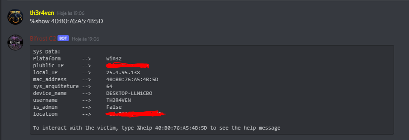
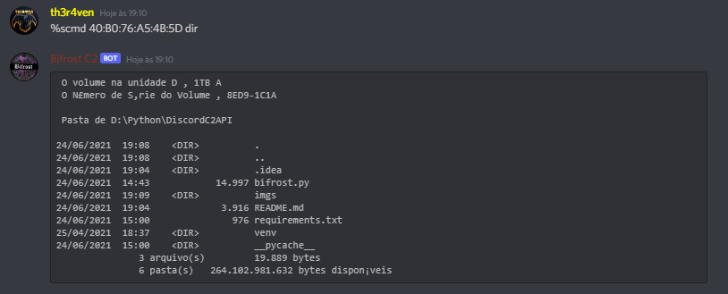
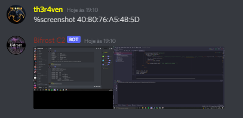

<h1 align="center">
  <br>
  <a href="https://github.com/th3r4ven/"></a>
  <br>
  Bifrost
  <br>
</h1>

<h4 align="center">Command and Control</h4>

<p align="center">
    
    
    
</p>

---

## What's Bifrost?

**Bifrost** is an open-source **Discord BOT** that works as **Command and Control** (C2). This C2 uses Discord API for communication between clients and server.

Developed with Python, this C2 have multiples features for post-exploitation.

## How Bifrost works?

As mentioned before, Bifrost is basically a discord bot that receive commands from the Discord user and do a pre-defined task.

So for every client that you are going to "infect", you will send a copy of this discord bot, and it will respond to you using discord. 
 This allows you to hide behind Discord service being stealth and have a secure connection between you and your client.

**Disclaimer: This project should be used for authorized testing or educational purposes only.**

### Virustotal

Virustotal detection was **5/67** when there was none defense against sandbox execution.

Antivirus that detected Bifrost as malicious was `SecureAge APEX`, `Jiangmin`, `Cynet`, `Zillya` and `Palo Alto Networks`


### Bifrost Features

- [x] Multiple clients.
- [x] Multi-platform support. 
- [x] Keylogger.
- [x] Antivirus enumeration.
- [x] Real-time communication.
- [x] Encrypted(HTTPS) communication.
- [x] Fast and stealth communication trough Discord API.
- [x] No need of public service.
- [x] Screenshot gathering.
- [x] Download and upload of files.

---
### ⚠️Contributors ⚠️

Bifrost is an open project, so, if you want to add some functionality, improve features or code performance in Bifrost, the best way to get it to the main project is to create a fork and open pull request.

---
## Installation

1 - Clone or download Bifrost source code;
    
2 - Install lib dependencies;

````shell
pip install -r requirements.txt
````

3 - Have Discord account;

4 - [Create an application (Bot)](https://discord.com/developers/applications) on Discord;

5 - Go to General information tab and copy your **Application ID**;

6 - Go to Bot tab, create the Bot and copy it's token

7 - Invite your bot to your discord server by filling up the following link with your application ID;

`https://discord.com/oauth2/authorize?client_id=<APP_ID>&scope=bot&permissions=8`

8 - Now create a channel in your Discord server and copy its ID;

**Obs.: Activate developers function in your discord app to copy channel ID easily.**

Now with those 2 information (channel ID and Bot Token), change the var values on 22 and 23 lines in bifrost.py file to your account/channel values.

---
## Client Installation

After creating your bot, channel and changing the variable values, follow the steps bellow to deploy the payload to your client

### Windows

Create an bifrost executable file using pyinstaller, or sending bifrost.py to client and installing all dependencies.

Using the **executable** file, the client don't need to have python or any dependencies pre-installed.

`pyinstaller bifrost.py --onefile --noconsole --key th3r4ven_bifrost` or \
`python -m pyinstaller bifrost.py --onefile --noconsole --key th3r4ven_bifrost`

OBS.: All of this params are optional, read pyinstaller documentation for more information on how to use it.

### Linux\Mac OS

You can send the bifrost.py and install the dependencies, or create and script/executable to automate this process, similar to windows installation

---

## To do

* Persistence feature
* Bind shell connection
* Stealth Download
* Upload big files anonymously
* Live/recorded voice streaming
* Fix Bugs/Issues
* In memory execution

**Screen live stream is not possible trough Discord API :(**

---

## Screenshots






---
